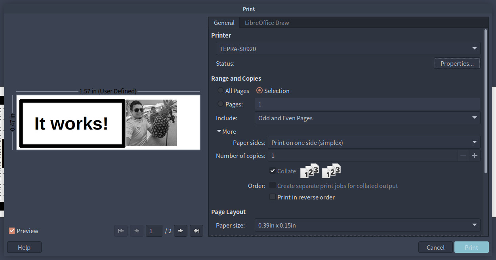
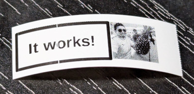
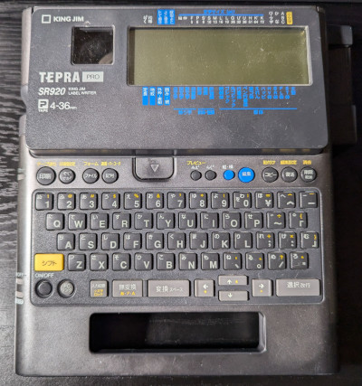

# TEPRAPRINT

キングジムのテプラPROシリーズ用印刷ユーティリティ

Author: [@nyacom](https://x.com/nyacom_net) (C) 2024

## これは何？

* USB接続対応の比較的古いテプラをLinuxで印刷するためのドライバ+ユーティリティ+CUPSラッパーです
* テプラを普通のCUPSプリンタとして扱うため、LibreOffice Drawなどから印刷できます




## 対応機種



* 現状、手持ちのSR920でしか動作確認していません。
* SPC9でサポートされている360dpiの機種であれば動作するかもしれませんが、未確認です。
* 180dpiの機種は調整すれば使えるのかもしれません
  * 誰か試してみてください。

## 対応環境

* 現状Debianでしか試していないため保証できませんが、CUPSを使っているMacでも動くかもしれません。
  * そのうち試してみます。

## 使い方（暫定)

* Python3とpyUSBが必要
  * お手持ちのテプラに合わせてUSBのproductIdを書き換えてください (pytepra.pyまたはtepraprint.py)  
* tepraprint.py を使うとPILが対応している画像ファイルを直接テプラに流しこんで印刷できます(CUPSを使わない場合)
* CUPSプリンタとして登録する場合は、cups以下にあるsr920.ppdをCUPSに登録してください。
  * cups/tepraprintの変数TEPRAPRINTをtepraprint.pyの置いてあるパスに通してください
  * Makefileにプリンタのインストールコマンドがあるので、make setup-printer でインストールできます。
  * udevルールを設定しておくと、一般ユーザでも印刷できるようになります。(99-tepraprint.rulesを参考にしてください)

## 更新履歴

* 2024/09/19 初版リリース

## License

MIT

## TODO

* まともなドキュメントを用意する


以下、開発用のメモ書き。

----

## ESC/P2Lプロトコル分析メモ

### SR920のプリンタコマンド

* ESP/P2Lと名乗っている通り、ESP/Pっぽいのだが基本的に独自仕様
  * まあ、エプソンのOEMなのでそりゃそうか・・・
* PCからの印刷の場合、基本的にラスタで送られてくることしか想定していないのだと思われる
  * SPC9に本体内蔵のフォントを使って印刷する機能がないことからの想像

#### 基本構成

印刷パケットの先頭にページ設定コマンドが挿入され、その後に印刷データが続く構成

```
1b7b074302020101497d (カット指定)
1b7b044405497d (濃度指定)
1b7b0347477d (わからん。多分JOBとしての定義を区切るためのコマンド？)

1b7b074ca9010000f67d (ドキュメント印刷長）
1b7b05540e00627d (印刷開始オフセット)
...(以下印刷データ)
1b2e000a0a019000000000000000000000000000000000000000
1b2e000a0a019000000000000000000000000000000000000000
1b2e000a0a019000000000000000000000000000000000000000
1b2e000a0a019000000000000000000000000000000000000000
1b2e000a0a019000000000000000000000000000000000000000
1b2e000a0a019000000000000000000000000000000000000000
1b2e000a0a019000000000000000000000000000000000000000
1b2e000a0a019000000000000000000000000000000000000000
1b2e000a0a019000000000000000000000000000000000000000
1b2e000a0a019000000000000000000000000000000000000000
1b2e000a0a019000000000000000000000000000000000000000
...
0c (データ終端?)
1b7b0340407d (終了コマンド?)

```

印刷パケットの先頭に入っている設定がコマンドの詳細は現状わからないが、SPC10から色々印刷してみて分析した結果として、以下の仕様であることが判明した。

* 制御系のコマンドは 1b 7b (ESC {) で始まり、Checksum 7d(})で終わる
  * 例えば 1b 7b 07  43 02 02 01 01  49  7d だと 1b 7b 07 43 までがコマンド、49が43から01までを加算したチェックサムで49、7dがコマンドの終わりを示す。

* 印刷長（テープ長）などのパラメータはLowByte, HighByteの順の16bitリトルエンディアンで格納されている
* 印刷長の単位は何かしらのユニット単位で決まっており、SPC10から指定長印刷を行った結果以下となった
  * 0x008d --> 10mm
  * 0x011b --> 20mm
  * 0x01a9 --> 30mm
* ここから逆算すると、1mmあたり14.172 unitのようだ。この値は360dpiから来てる?
  * ひょっとすると、物理的なサーマルヘッドの大きさ(27mm程度)と解像度(SR920の場合384dot)から来てる?
  * 多分360 / 25.4 = 14.173 かな・・？
* ちなみにSPC9で指定できる印刷長は最大で500mmまでなので、0x1baeが最大値となるようだが、実際にはもっと長くいける

### テープ幅

* GET_PORT_STATUSを送るとUSBPRINTERクラスの仕様で通常はプリンタのステータスが返ってくる。
  * 普通は先頭1バイトがプリンタの状態なのだが、テプラの場合は8バイト返してきて、テープ幅がXバイト目に入っている
  * ちなみに、先頭1バイト目のプリンタステータスはいつ読んでも不変なので固定なのかも？

* SPC10-APIのマニュアルにテープ幅の定義が書いてあった。多分この通りになっているのではないかと思う。
  * 4mmが0x0Bのあたりで、元々なかったテープ幅なのだろうか？
  * SR920は36mmテープまでしか物理的に入らないのでPPDファイルには36mmまでしか定義していない。

| Byte | Tape Width       |
| ---- | ---------------- |
| 0x00 | None             |
| 0x01 | 6mm              |
| 0x02 | 9mm              |
| 0x03 | 12mm             |
| 0x04 | 18mm             |
| 0x05 | 24mm             |
| 0x06 | 36mm             |
| 0x07 | 50mm             |
| 0x0B | 4mm              |
| 0x21 | 50mm ※WR1000 用  |
| 0x23 | 100mm ※WR1000 用 |
| 0xFF | Unknown          |

* Xバイト目はテープの種類らしい
  * 多分。
  * 実はスタンダードテープしか持っていないのでわからないが、普通のプリンタドライバ作るだけなら多分知らなくても困らない。

| Byte | Tape Type                  |
| ---- | -------------------------- |
| 0x01 | Pre-cut_label カットラベル |
| 0x02 | Transfer_tape 転写テープ   |
| 0x00 | Standard_tape 上記２種以外 |


### 印刷長の指定コマンド
1b7b074c で始まるコマンドが印刷長の指定で、その後に続く2バイトが印刷長を指定するが、その後の2バイトの用途は今の所不明。

定長10mm印刷の場合のヘッダ部分

```
1b7b0743  02 02 01 01  49 7d
1b7b0444  05           49 7d
1b7b0347               47 7d
    
1b7b074c  8d 00 00 00  d9 7d   # 印刷長10mm
1b7b0554  0d 00 61 7d
...
...

```

定長20mm印刷の場合ヘッダ部分

```
1b7b0743  02 02 01 01  49 7d
1b7b0444  05 49 7d
1b7b0347  47 7d

1b7b074c  1b 01 00 00  68 7d  # 印刷長20mm
1b7b0554  0e 00 62 7d
...
...

```

定長30mm印刷の場合ヘッダ部分

```
1b7b0743  02 02 01 01   49 7d
1b7b0444  05 49 7d
1b7b0347  47 7d

1b7b074c  a9 01 00 00   f6 7d # 印刷長30mm
1b7b0554  0e 00 62 7d
...
...

```

### カットの指定コマンド

カットも指定でき、1b7b0743 で始まるコマンドの後に続くバイトでカット挙動を指定

| コマンド                | 説明                                  |
| ----------------------- | ------------------------------------- |
| 1b7b0743 00000000 43 7d | カットなし                            |
| 1b7b0743 02020101 49 7d | カットあり，ハーフカットする          |
| 1b7b0743 03010101 49 7d | カットあり，ハーフカットしない        |
| 1b7b0743 03000101 48 7d | JOB毎にカットする，ハーフカットしない |
| 1b7b0743 02000101 47 7d | JOB毎にカットする，ハーフカットする   |
| 1b7b074c 8d000000 d9 7d | 連続印刷2枚目以降で指定する           |


### 濃度の指定コマンド

印刷濃度の指定は、1b7b0745 で始まるコマンドの後に続くバイトで濃度を指定

| コマンド          | 説明       |
| ----------------- | ---------- |
| 1b7b0444 02 46 7d | 濃度(-3)   |
| 1b7b0444 03 47 7d | 濃度(-2)   |
| 1b7b0444 04 47 7d | 濃度(-1)   |
| 1b7b0444 05 47 7d | 濃度(標準) |
| 1b7b0444 06 47 7d | 濃度(+1)   |
| 1b7b0444 07 47 7d | 濃度(+2)   |
| 1b7b0444 08 4c 7d | 濃度(+3)   |

### 印刷用データの構成

印刷用データは 1b2e00... から始まるパケットで、印刷データが続く。

唯一この辺だけがESC/Pチックな部分で、基本的にESC/Pのラスタ描画コマンドと同じっぽい

```text
ESC . COMPRESS1 VSEP1 HSEP1 LINES1 WIDTH data...
```

* COMPRESS1は圧縮方式。テプラの場合は必ず0x00(非圧縮が入る)
* VSEP1は縦のDPIを示す。テプラの場合は360dpiなので0x0a(10)が入る
* HSEP1は横のDPIを示す。テプラの場合は360dpiなので0x0a(10)が入る
* LINES1は印刷する行数を示す。テプラの場合は必ずテープ走査方向に向かってテープ幅分を1列づつ印字していくので0x01が入る
* WIDTHは印刷する幅を示す。テプラの場合はテープ幅に応じた値が入る
  * 1mmあたり0xC(12)が入るので、例えば12mmのテープの場合は0x90(144)となる
* dataはWIDTHのビット数分のデータが続き、例えば12mmのテープの場合は144ビット(36バイト)のデータが続く

## Ghostscript

CUPSに対応させようとすると、CUPSはPostScriptで投げてくるので、Ghostscriptを使ってラスタデータに変換する必要がある。

```bash
gs -dSAFER -dBATCH -dNOPAUSE -sDEVICE=pnggray -o - -q -r360 logo.ps | ./tepraprint.py -i -
```

* -q が無いと、GhostscriptがSTDINにバナーを出力してしまうので、受け取ったときにPILに壊れてると怒られる。

## References

Universal Serial Bus Device Class Definition for Printing Devices (<https://www.usb.org/sites/default/files/usbprint11a021811.pdf>)
